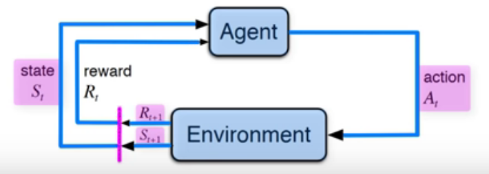

## MDPs - Markov Decision Processes
- Formalize sequential decision making
  - decision maker = Angent
  - interactions occur sequentaly over time
  - each agent get infos about the environment state
  - Agent select an action to take
  - the environment changes --> new states
  - The Agent get reward for its previous action
- Ingredients:
  - Environment
  - Agent 
  - States (S) (t=step)
  - Actions (A)
  - Rewards (R)
- Aim
  - Maximize rewards gloabally
- Workflow
  - 

- T = final times step
#### Episodic tasks
- subsequences = episodes
example : ping-pong there are
some actions during a play
the end of the episode when
someone make a mistake  the winner  get a new point
- after an episode the environment set back to some standerd starting state, or to a random state of the possible starting states 
#### Continuing tasks
- continue without limit
- no episodes
- T=infinity --> process never ends
- Discount rate
  - determine the future rewards 
  - care more about immediate reward
  - Gt = sum of discounted rewards 

#### polices
- What is the probability that an agent will select a specific action frrom a specific state?
- maps a given state to pobabilities
  - Hogyha a rendzsabaolyok szerint jarunk el akkor PI
    esely lesz arra hogy sikerrel jarunk
  - Minden allaplotra  van egy PI esely, hogy jo neknunk az A akcioval
#### value functions
- how good is a specific action or state for the agent?
- functions of states or state action pairs
- expected return , várt érték arra mennyire jo nekunk egy dolog
  - state value funciton
    - mennyire jo agy allapot ha az agens koveti a rendszabalyokat
  - action value function
    - Q function = q(state, action)
    - Q value
    - Q = quality of taking a given action in a given state

## Optimal polices 
  - a legjobb rendszabaly amit ha kovetunk a legtobb rewardot kapunk
  - maximize q* for each state

## Exploration vs exploitation
- epszilon
  - default  1
  - 0.5 azt jelenti , hogy 50% az eselye hogy kimaxolni akar
  - 0.1 nel mar nagyon csak a kimaxolasra megy
- minden iteracioban egy random szamot kapunk
  - Ha a random szam kisebb mint az epszilon --> Exploration
    - PL random szam = 0.45 és epszilon = 0.5  -> epxploration
    - PL random szam = 0.9 és epszilon = 1  -> epxploration
    - PL random szam = 0.9 és epszilon = 0.5  -> !!exploITAtion!
  - Ha a random szam NAGYOBB mint az epszilon --> exlloitation
    - ...
    
## Learning rate
- 0 és 1 között

## calculate new q value
- sulyozott osszege a regi q erteknek es az ujonnan tanult erteknek
  - a regi ertek default 0 ha meg nem volt ott semmi
    - szorozva (1- learning rate)-vel
--------------------------------------------
if x:
  print(1)
elif y:
  print(2)
elif a or b or c:
  print(3)
elif d or e:
  print(4)
else:
  print(5)

osszes elif = 3
osszes eleagazas = 5
max feltételszám egy if/elif-ben = 3
osszes vizsgalt feltetel = 7
sorok szama mindennel egyutt = 10
avg - feltetelszam / if = 7/4 = 1.75
uj sorok - regi sorok = hany sorral tobb vagy kevesebb lett

-- kerdes kell e az atalakitas
