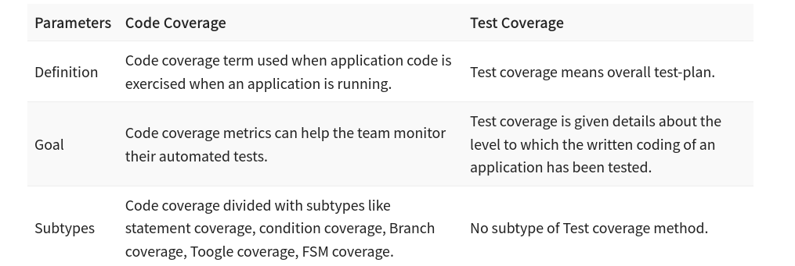

# Test Coverage
- a metric in Software Testing that measures the amount of testing performed by a set of test
  - which parts of a program are executed when running the test
  -  how much of your code you exercised by running the test.
### Differences Between Code Coverage And Test Coverage

